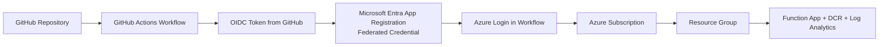

# Log Ingestion API

Backend deployment package for the Log Ingestion solution.

It deploys and updates:
- Log Analytics workspace and custom tables
- Data Collection Rule (Direct)
- Function App (PowerShell)
- Intune upload script integration points

Schema source of truth:
- schema/columns.json

## Prerequisites

- PowerShell 7+
- Azure CLI (az)
- Azure Functions Core Tools (optional; script falls back to zip deploy)

Sign in first:
- az login
- az account set --subscription <name-or-id>

## Deploy

```powershell
cd scripts
./deploy.ps1 -ResourceGroup rg-logging-dev -Location eastus `
  -FunctionAppName func-logingestion-dev `
  -WorkspaceName log-logingestion-dev `
  -DcrName dcr-logingestion-dev
```

The script validates schema, deploys infra, publishes function code, and prints
next steps.

## Cloud Shell option (no local admin install)

If you already cloned this repo in Cloud Shell and want a clean re-clone:

```bash
cd ~
rm -rf LogIngestionPortal
git clone https://github.com/sandytsang/LogIngestionPortal.git
```

Then deploy:

```bash
cd LogIngestionPortal/LogIngestionAPI/scripts
pwsh ./deploy.ps1 \
  -Subscription <subscription-name-or-id> \
  -ResourceGroup rg-logging-dev \
  -Location eastus \
  -FunctionAppName func-logingestion-dev \
  -WorkspaceName log-logingestion-dev \
  -DcrName dcr-logingestion-dev \
  -SchemaPath /home/<your-user>/columns.json
```

## Common options

- Contributor-only deploy (no roleAssignments/write):

```powershell
./deploy.ps1 -ResourceGroup rg-logging-dev -Location eastus `
  -FunctionAppName func-logingestion-dev `
  -WorkspaceName log-logingestion-dev `
  -DcrName dcr-logingestion-dev `
  -SkipDcrRoleAssignment
```

- Place workspace and DCR in different resource groups:

```powershell
./deploy.ps1 -ResourceGroup rg-fn -Location eastus `
  -FunctionAppName func-logingestion-dev `
  -WorkspaceName log-shared-monitoring `
  -WorkspaceResourceGroup rg-shared-monitoring `
  -WorkspaceLocation westeurope `
  -DcrName dcr-logingestion-dev `
  -DcrResourceGroup rg-dcr
```

- Update only table and DCR (no Function App changes):

```powershell
./deploy.ps1 -SchemaOnly `
  -WorkspaceName log-logingestion-dev `
  -WorkspaceResourceGroup rg-logging-dev `
  -DcrName dcr-logingestion-dev `
  -DcrResourceGroup rg-logging-dev
```

## GitHub Actions

Workflows in .github/workflows:
- validate.yml
- deploy.yml
- update-columns.yml

Use branch-based OIDC with:
- AZURE_CLIENT_ID
- AZURE_TENANT_ID
- AZURE_SUBSCRIPTION_ID

### GitHub OIDC connection architecture



### Microsoft documentation (setup and reconnect)

- GitHub Actions to Azure with OpenID Connect:
  https://learn.microsoft.com/azure/developer/github/connect-from-azure-openid-connect
- Configure federated identity credential on an app registration:
  https://learn.microsoft.com/entra/workload-id/workload-identity-federation-create-trust?pivots=identity-wif-apps-methods-azp#configure-a-federated-identity-credential-on-an-app
- Azure Login GitHub Action reference:
  https://github.com/marketplace/actions/azure-login

### Reconnect checklist

1. Create or reuse an Entra app registration.
2. Add a federated credential for your repo and branch (for example `main`).
3. Assign Azure RBAC roles to the app's service principal.
4. Set repo secrets:
   - `AZURE_CLIENT_ID`
   - `AZURE_TENANT_ID`
   - `AZURE_SUBSCRIPTION_ID`
5. Ensure workflow permissions include `id-token: write`.
6. Run the workflow and confirm the Azure login step succeeds.

## Security model summary

- Device-signed JWT is always required.
- Function managed identity needs Graph Device.Read.All when Entra device check
  is enabled.
- DCR ingestion needs Monitoring Metrics Publisher role on the resource group that holds the DCR.

`deploy.ps1` attempts both permissions by default. If assignment fails (for
example, Contributor-only deployer or missing Entra admin rights), deployment
continues and prints manual follow-up commands. The native GitHub workflow also
checks these permissions and warns (does not fail) when they are missing.

### Cloud Shell follow-up if permission assignment failed

For a full operator runbook (required roles, verification checks, and escalation
inputs), see
[Manual permission fallback runbook](docs/manual-permission-fallback-runbook.md).

Grant DCR ingestion permission (Monitoring Metrics Publisher) with the helper
script (assigns on the DCR resource group scope):

```powershell
./scripts/AssignDcrPublisherPermission.ps1 `
  -FunctionResourceGroup <function-resource-group> `
  -FunctionAppName <function-app-name> `
  -DcrRg <dcr-resource-group> `
  -Subscription <subscription-id>
```

Grant Graph Device.Read.All (when `JWT_REQUIRE_ENTRA_DEVICE=true`) with the
helper script:

```powershell
./scripts/AssignMSIPermisison.ps1 `
  -ResourceGroup <function-resource-group> `
  -FunctionAppName <function-app-name>
```

Equivalent raw Azure CLI commands (advanced/troubleshooting):

```bash
# Inputs needed for raw commands:
# - <subscription-id>
# - <dcr-resource-group>
# - <function-mi-object-id>

# 1) Monitoring Metrics Publisher on DCR resource group
az account set --subscription <subscription-id>
az role assignment create \
  --assignee-object-id <function-mi-object-id> \
  --assignee-principal-type ServicePrincipal \
  --role "Monitoring Metrics Publisher" \
  --scope "/subscriptions/<subscription-id>/resourceGroups/<dcr-resource-group>"

# 2) Graph Device.Read.All
MI="<function-mi-object-id>"
GRAPH_SP=$(az ad sp list --filter "appId eq '00000003-0000-0000-c000-000000000000'" --query '[0].id' -o tsv)
ROLE="7438b122-aefc-4978-80ed-43db9fcc7715"
az rest --method POST \
  --uri "https://graph.microsoft.com/v1.0/servicePrincipals/$MI/appRoleAssignments" \
  --headers 'Content-Type=application/json' \
  --body "{\"principalId\":\"$MI\",\"resourceId\":\"$GRAPH_SP\",\"appRoleId\":\"$ROLE\"}"
```

For a detailed explanation of how the device-signed JWT and certificate chain
work (how the client sends the certificate and how the server validates it), see
[Device authentication: JWT + certificate chain](docs/device-jwt-authentication.md).

## Documentation

In-depth guides:

- [Architecture overview](docs/architecture-overview.md)
- [Deployment reference](docs/deployment-reference.md)
- [Schema and columns](docs/schema-and-columns.md)
- [AppLocker events: querying and dedup](docs/applocker.md)
- [RBAC and permissions](docs/rbac-and-permissions.md)
- [Security hardening](docs/security-hardening.md)
- [Testing and CI](docs/testing-and-ci.md)
- [Troubleshooting](docs/troubleshooting.md)
- [Device authentication: JWT + certificate chain](docs/device-jwt-authentication.md)
- [Manual permission fallback runbook](docs/manual-permission-fallback-runbook.md)

## Project layout

- infra/
- function/
- scripts/
- scripts/AssignMSIPermisison.ps1
- scripts/AssignDcrPublisherPermission.ps1
- schema/columns.json
