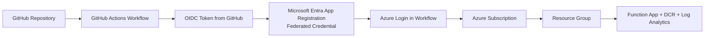

# Log Ingestion API

Backend deployment package for the Log Ingestion solution.

It deploys and updates:
- Log Analytics workspace and custom tables
- Data Collection Rule (Direct)
- Function App (PowerShell)
- Intune upload script integration points

Schema source of truth:
- schema/columns.json

## Prerequisites

- PowerShell 7+
- Azure CLI (az)
- Azure Functions Core Tools (optional; script falls back to zip deploy)

Sign in first:
- az login
- az account set --subscription <name-or-id>

## Deploy

```powershell
cd scripts
./deploy.ps1 -ResourceGroup rg-logging-dev -Location eastus `
  -FunctionAppName func-logingestion-dev `
  -WorkspaceName log-logingestion-dev `
  -DcrName dcr-logingestion-dev
```

The script validates schema, deploys infra, publishes function code, and prints
next steps.

## Cloud Shell option (no local admin install)

```bash
git clone https://github.com/sandytsang/LogIngestionPortal.git
cd LogIngestionPortal/LogIngestionAPI/scripts
pwsh ./deploy.ps1 \
  -Subscription <subscription-name-or-id> \
  -ResourceGroup rg-logging-dev \
  -Location eastus \
  -FunctionAppName func-logingestion-dev \
  -WorkspaceName log-logingestion-dev \
  -DcrName dcr-logingestion-dev \
  -SchemaPath /home/<your-user>/columns.json
```

## Common options

- Contributor-only deploy (no roleAssignments/write):

```powershell
./deploy.ps1 -ResourceGroup rg-logging-dev -Location eastus `
  -FunctionAppName func-logingestion-dev `
  -WorkspaceName log-logingestion-dev `
  -DcrName dcr-logingestion-dev `
  -SkipDcrRoleAssignment
```

- Place workspace and DCR in different resource groups:

```powershell
./deploy.ps1 -ResourceGroup rg-fn -Location eastus `
  -FunctionAppName func-logingestion-dev `
  -WorkspaceName log-shared-monitoring `
  -WorkspaceResourceGroup rg-shared-monitoring `
  -WorkspaceLocation westeurope `
  -DcrName dcr-logingestion-dev `
  -DcrResourceGroup rg-dcr
```

- Update only table and DCR (no Function App changes):

```powershell
./deploy.ps1 -SchemaOnly `
  -WorkspaceName log-logingestion-dev `
  -WorkspaceResourceGroup rg-logging-dev `
  -DcrName dcr-logingestion-dev `
  -DcrResourceGroup rg-logging-dev
```

## GitHub Actions

Workflows in .github/workflows:
- validate.yml
- deploy.yml
- update-columns.yml

Use branch-based OIDC with:
- AZURE_CLIENT_ID
- AZURE_TENANT_ID
- AZURE_SUBSCRIPTION_ID

### GitHub OIDC connection architecture



### Microsoft documentation (setup and reconnect)

- GitHub Actions to Azure with OpenID Connect:
  https://learn.microsoft.com/azure/developer/github/connect-from-azure-openid-connect
- Configure federated identity credential on an app registration:
  https://learn.microsoft.com/entra/workload-id/workload-identity-federation-create-trust?pivots=identity-wif-apps-methods-azp#configure-a-federated-identity-credential-on-an-app
- Azure Login GitHub Action reference:
  https://github.com/marketplace/actions/azure-login

### Reconnect checklist

1. Create or reuse an Entra app registration.
2. Add a federated credential for your repo and branch (for example `main`).
3. Assign Azure RBAC roles to the app's service principal.
4. Set repo secrets:
   - `AZURE_CLIENT_ID`
   - `AZURE_TENANT_ID`
   - `AZURE_SUBSCRIPTION_ID`
5. Ensure workflow permissions include `id-token: write`.
6. Run the workflow and confirm the Azure login step succeeds.

## Security model summary

- Device-signed JWT is always required.
- Function managed identity needs Graph Device.Read.All when Entra device check
  is enabled.
- DCR ingestion needs Monitoring Metrics Publisher role on the DCR.

## Project layout

- infra/
- function/
- scripts/
- schema/columns.json
