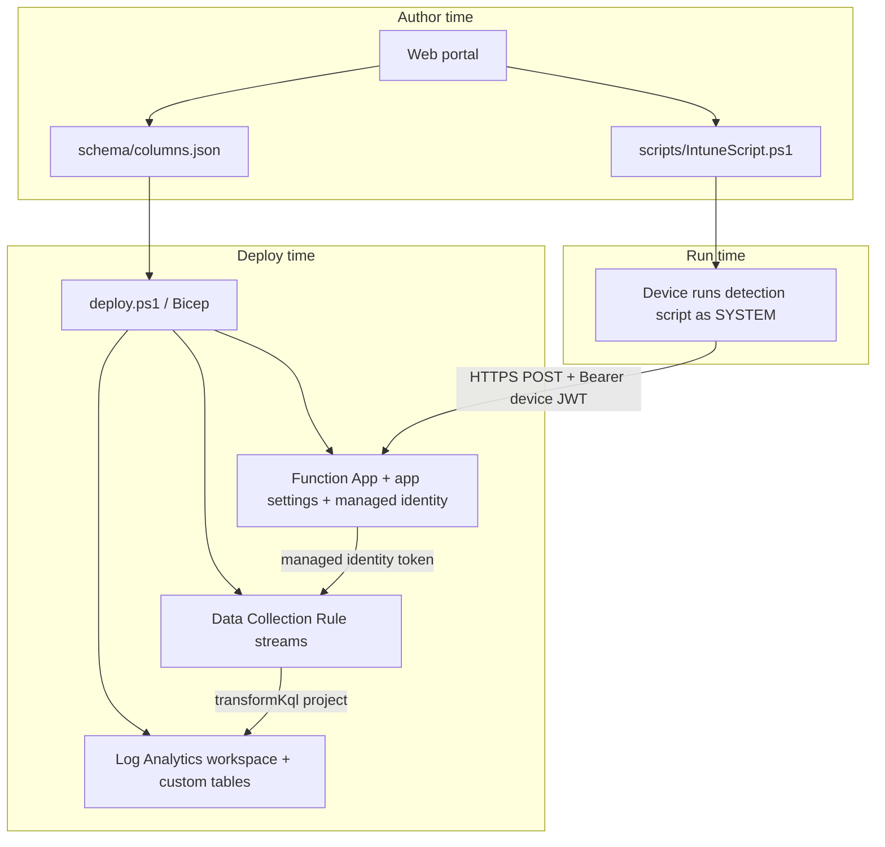

# Architecture overview

This document describes the full Log Ingestion solution end to end: how a field
selection in the web portal becomes a row in a Log Analytics custom table.

## Components

| Component | Where | Role |
|-----------|-------|------|
| Web portal | `LogIngestionPortalWebPortal/` (React + Vite, browser-only) | Pick telemetry fields; generate `schema/columns.json`, `scripts/IntuneScript.ps1`, and a deploy `README.txt`. |
| Deployment package | `LogIngestionAPI/` | Bicep infra + PowerShell Function + `deploy.ps1`. |
| Function App | `LogIngestionAPI/function/` (PowerShell 7.4) | Authenticates requests (device JWT) and forwards records to the DCR. |
| Data Collection Rule (DCR) | `infra/modules/dcr.bicep` (kind `Direct`) | One `Custom-<table>` stream per table; `transformKql` projects columns into the table. |
| Log Analytics workspace | `infra/modules/logAnalytics.bicep` | Hosts the custom `_CL` tables. |
| Device script | `scripts/IntuneScript.ps1` | Runs on devices via Intune Proactive Remediation; collects data and uploads it. |

## End-to-end flow

## Run-time request path

1. **Device collects data.** The Intune detection script
   ([`Get-DeviceData`](../scripts/IntuneScript.ps1)) builds an object whose
   properties match the columns in `schema/columns.json`.
2. **Device authenticates.** It mints a short-lived device JWT signed with its
   Entra-join certificate and sends `Authorization: Bearer <jwt>` (see
   [Device authentication](device-jwt-authentication.md)).
3. **Function validates and routes.** [`run.ps1`](../function/DCRLogIngestionAPI/run.ps1)
   verifies the JWT, then accepts a body that is either:
   - **table-keyed** — `{ "MyTable_CL": [ { ... } ] }` (routed to
     `Custom-MyTable_CL`), or
   - a **bare array / single object** — routed to the default table from the
     optional `DCR_STREAMS` app setting.
4. **Batching.** Records are split into batches under ~950 KB (the Logs
   Ingestion API rejects single calls over 1 MB); any record that alone exceeds
   the limit is skipped, not failed.
5. **Ingestion.** The Function gets a managed-identity token for
   `https://monitor.azure.com` and POSTs each batch to the DCR's
   `logsIngestion` endpoint for the matching `Custom-<table>` stream.
6. **Transform and store.** The DCR's `transformKql`
   (`source | project <columns>`) projects the declared columns into the custom
   `_CL` table.

## Why a DCR with per-table streams

The DCR ([dcr.bicep](../infra/modules/dcr.bicep)) declares one stream per table
(`Custom-<tableName>`) and one data flow each. Because the Function routes
table-keyed bodies by name, adding or removing a column — or an entire table —
is a **schema-only** change: update `schema/columns.json` and re-run the table +
DCR update. The Function code never changes because it is schema-agnostic.

## Source of truth

`schema/columns.json` defines the tables and columns. Both the generated device
script and the deployed table/DCR derive from it, which keeps the producer
(device) and the destination (table) in sync. See
[Schema and columns](schema-and-columns.md).
