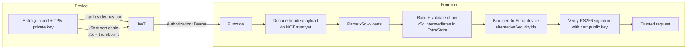

# Device authentication: JWT + certificate chain

This document explains, in detail, how the Log Ingestion solution authenticates
every request using a **device-signed JWT** and how the **certificate chain** is
sent and validated. It is the human-readable companion to the inline comments in
the code.

- Client (token creation): [`New-DeviceJwt`](../scripts/IntuneScript.ps1) in the
  Intune remediation script (and its template
  `LogIngestionPortalWebPortal/src/lib/scriptTemplate.ps1`).
- Server (token validation): the
  [`DeviceJwtAuth`](../function/Modules/DeviceJwtAuth/DeviceJwtAuth.psm1) module,
  called by the Function on every request.

---

## TL;DR

The device proves who it is by signing a short-lived JWT with the **private key
of its Entra-join (MS-Organization-Access) certificate**. The certificate and
its full chain travel *inside the JWT header* (the standard `x5c` field), so the
server can validate the certificate and rebuild its chain without having any of
those certificates installed locally. Possession of the TPM-bound private key —
provable only by a valid signature — is the actual proof of identity.



---

## What a JWT is here

A JWT (JWS compact form) is three Base64URL segments joined by dots:

```
<header> . <payload> . <signature>
```

- **header** — JSON describing the signature algorithm and the signing
  certificate.
- **payload** — JSON claims identifying the caller.
- **signature** — bytes signing `ASCII("<header>.<payload>")`.

Base64URL is normal Base64 with `+`/`/` replaced by `-`/`_` and `=` padding
removed.

### Header fields used

| Field | Meaning |
|-------|---------|
| `alg` | Always `RS256` (RSA + SHA-256). Pinned by the server to prevent algorithm-confusion attacks. |
| `typ` | `JWT`. |
| `x5t` | Base64URL of the **SHA-1 thumbprint** of the signing (leaf) certificate. A quick fingerprint. |
| `x5c` | **The certificate chain** as an array of Base64 DER certs, leaf first, root last. This is how the certificate is transmitted. |

### Payload claims used

| Claim | Meaning |
|-------|---------|
| `tid` | Entra tenant id. |
| `did` | Entra device id (the device object's `deviceId`). |
| `nonce` | Random value making every token unique. |
| `iat` | Issued-at (Unix seconds). |
| `exp` | Expiry — the token is valid for 5 minutes. |
| `aud` | Optional audience (the Function URL), if configured. |

---

## Client side — how the certificate is sent

See [`New-DeviceJwt`](../scripts/IntuneScript.ps1). The certificate is **not**
sent as a TLS client certificate or as a separate upload — it is embedded in the
JWT header.

1. **Locate the device certificate.** The script reads the
   `HKLM:\SYSTEM\CurrentControlSet\Control\CloudDomainJoin\JoinInfo` registry key
   to find the Entra-join certificate (issuer `MS-Organization-Access`) in the
   LocalMachine store. Its private key is TPM-bound and only accessible to
   `SYSTEM`.

2. **Compute `x5t`.** Base64URL of the certificate's SHA-1 thumbprint.

3. **Build `x5c` (the chain).** Starting from just the leaf certificate, the
   script calls `X509Chain.Build()` and replaces `x5c` with **every element of
   the resolved chain** (leaf -> intermediate(s) -> root), each Base64-encoded:

   ```powershell
   $chain.Build($Cert)
   $x5c = @($chain.ChainElements | ForEach-Object {
       [Convert]::ToBase64String($_.Certificate.RawData)
   })
   ```

   Sending the whole chain is what lets the server validate trust even though it
   has none of these certificates installed.

4. **Assemble and sign.** The header `{ alg, typ, x5t, x5c }` and payload
   `{ tid, did, nonce, iat, exp, aud? }` are Base64URL-encoded, then the script
   signs `ASCII("<header>.<payload>")` with the certificate's **private key**
   (`GetRSAPrivateKey`) using RS256. Only the genuine device — which holds the
   TPM-protected private key — can produce this signature.

5. **Send it.** The token is sent as a normal HTTP header:

   ```http
   Authorization: Bearer <header>.<payload>.<signature>
   ```

> Because the private key is TPM-bound, signing only works in **SYSTEM** context.
> Run the script via Intune Proactive Remediation with "Run this script using the
> logged-on credentials = No", or locally with `psexec -s -i powershell.exe`.

---

## Server side — how the certificate and chain are checked

See [`Test-DeviceRequestJwt`](../function/Modules/DeviceJwtAuth/DeviceJwtAuth.psm1),
which orchestrates the steps below. Nothing in the token is trusted until the
signature is verified at the very end.

### 1. Decode (but do not trust)

The header and payload are Base64URL-decoded so the server can read `x5c`, `x5t`
and `did`. The tenant (`tid`) can optionally be pinned here.

### 2. Rebuild the certificates from `x5c`

[`Get-X5cCertificates`](../function/Modules/DeviceJwtAuth/DeviceJwtAuth.psm1)
turns each Base64 `x5c` entry back into an `X509Certificate2`. Entry `[0]` is the
**leaf** (the cert whose private key signed the token); the remaining entries are
the intermediates/root.

### 3. `x5t` integrity check

The server recomputes the leaf certificate's thumbprint and confirms it matches
`x5t`, ensuring the header is internally consistent (the `x5t` and `x5c` describe
the same certificate).

### 4. Chain validation

[`Test-CertificateChainTrust`](../function/Modules/DeviceJwtAuth/DeviceJwtAuth.psm1)
validates the certificate path. The important detail for "how the chain is
checked":

- The leaf certificate is passed to `X509Chain.Build()`.
- The **other `x5c` entries are added to `ChainPolicy.ExtraStore`**, which is how
  the server supplies the intermediates/root it does not have installed:

  ```powershell
  -AdditionalCertificates @($presentedCerts | Select-Object -Skip 1)
  ```

- The chain engine verifies each link: signatures, validity dates, and
  (optionally) revocation via CRL/OCSP.
- Trust is then decided one of two ways:
  - **Thumbprints pinned** (`JWT_TRUSTED_ROOT_THUMBPRINTS` /
    `JWT_TRUSTED_INTERMEDIATE_THUMBPRINTS`): the resolved root (last chain
    element) must be on the allow-list, and at least one intermediate must match.
  - **Nothing pinned**: Entra device certs chain to a root the host does not
    trust, so the chain engine is told to tolerate `UntrustedRoot` /
    `PartialChain`. Trust is then established by the Entra binding (step 5) and
    the signature (step 6) instead.

### 5. Bind the certificate to a real device

When `JWT_REQUIRE_ENTRA_DEVICE` is on (the default),
[`Get-DeviceCertPublicKey`](../function/Modules/DeviceJwtAuth/DeviceJwtAuth.psm1)
looks the device up in Entra by `did` and confirms **this exact certificate** is
registered to it. Entra stores key credentials in `alternativeSecurityIds`; the
server requires both the certificate **thumbprint** and the **SHA-256 hash of the
public key** to appear in the same entry. This prevents anyone presenting a
different (but otherwise valid-chain) certificate.

### 6. Verify the signature and claims

[`Test-DeviceJwt`](../function/Modules/DeviceJwtAuth/DeviceJwtAuth.psm1) verifies
the RS256 signature using the **public key of the trusted certificate**. A valid
signature proves the caller holds the matching private key. It also enforces:

- `alg == RS256` (algorithm pinning),
- `iat`/`exp` freshness within the allowed clock skew (default 300s),
- optional `aud` (audience binding),
- and finally that the signed `did` matches the resolved device.

If every step passes, the request is authenticated.

---

## Configuration (Function App settings)

| App setting | Default | Purpose |
|-------------|---------|---------|
| `JWT_REQUIRE_ENTRA_DEVICE` | `true` | Resolve the device in Entra and validate the cert against `alternativeSecurityIds`. Needs Graph **Device.Read.All**. Set `false` to validate signature + issuer + thumbprint only (no Graph). |
| `JWT_REQUIRE_CERT_CHAIN` | `true` | Enforce certificate chain validation before Graph/signature checks. Set `false` only for troubleshooting. |
| `JWT_TRUSTED_ROOT_THUMBPRINTS` | _(none)_ | Comma-separated allow-list of acceptable root certificate thumbprints. |
| `JWT_TRUSTED_INTERMEDIATE_THUMBPRINTS` | _(none)_ | Comma-separated allow-list of acceptable intermediate certificate thumbprints. |
| `JWT_CHECK_CERT_REVOCATION` | `false` | Set `true` to perform online CRL/OCSP revocation checks. |
| `JWT_ALLOWED_TENANT_ID` | _(none)_ | If set, the `tid` claim must equal this. |
| `JWT_EXPECTED_AUDIENCE` | _(none)_ | If set, the `aud` claim must equal this (e.g. `https://<func>.azurewebsites.net`). |

---

## Why this design

- **The certificate is the identity** — issued to the device by Entra at join.
- **The chain travels in `x5c`** — so the server validates trust without
  pre-installing any certificates.
- **The signature is unforgeable** — it is produced with the TPM-protected
  private key, so only the real device can create a valid token.
- **Tokens are short-lived and unique** — `exp` (5 min) plus a random `nonce`
  bound the replay window.
