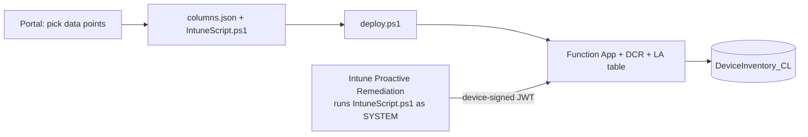
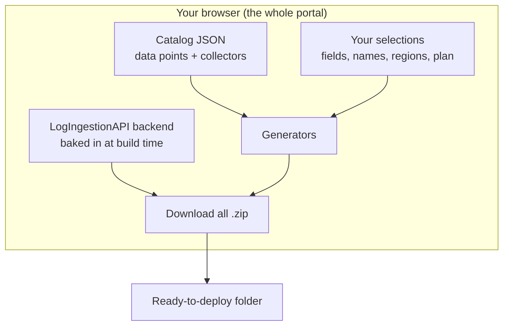

# Log Ingestion Portal

Collect Windows device telemetry with **Intune Proactive Remediations** and send it
to a **custom Log Analytics table** via the **Logs Ingestion API** — no agents, no
third‑party services. Pick the data you want in a browser, download the matching
artifacts, and deploy with one command.

**▶ Use the portal:** https://sandytsang.github.io/LogIngestionPortal/

> Runs entirely in your browser — no sign‑in, no backend, nothing leaves your machine.

The repo has two parts:

| Folder | What it is |
| --- | --- |
| [`LogIngestionPortalWebPortal/`](LogIngestionPortalWebPortal) | A static, 100% client‑side web portal that generates `columns.json`, the Intune detection script, and a deploy README. Runs entirely in your browser — no backend, nothing leaves your machine. |
| [`LogIngestionAPI/`](LogIngestionAPI) | The Azure solution: Bicep infrastructure (Log Analytics workspace, custom table, Data Collection Rule, PowerShell Function App) plus the deploy script and the device remediation script. |

## How it works



1. **Pick** the device properties in the portal and download the bundle.
2. **Deploy** the infrastructure with `LogIngestionAPI/scripts/deploy.ps1` (it
   builds the table + DCR from `columns.json` and publishes the Function code).
3. **Upload** `IntuneScript.ps1` as an Intune Proactive Remediation **detection**
   script. Devices collect the data and POST it to the Function, which forwards it
   to the DCR and into your Log Analytics table.

Every request is authenticated with a **device‑signed JWT** (proof of possession
of the device's Entra‑join certificate) — this is always required.

## Under the hood — what the portal actually does

The portal is a **static, 100% client‑side app** (TypeScript + React, built with
Vite, hosted on GitHub Pages). There is **no server, no API, no database, and no
sign‑in** — every calculation runs in your browser, and the download `.zip` is
assembled in‑browser too, so nothing you pick ever leaves your machine.



**Generated on the fly from your choices** (computed by [`src/lib/generators.ts`](LogIngestionPortalWebPortal/src/lib/generators.ts)):

| Output | Built from |
| --- | --- |
| `schema/columns.json` | The catalog + the fields/tables you select. |
| `scripts/IntuneScript.ps1` | The read‑only PowerShell collector bundled with each selected data point. |
| `README.txt` | A deploy guide with your exact names, regions, and `deploy.ps1` flags filled in. |
| The active workflow (`deploy.yml` **or** `update-columns.yml`) | The same file, with its **“Run workflow”** input defaults pre‑filled from your selections. |

**Shipped unchanged (baked into the static bundle at build time)** — the entire
[`LogIngestionAPI/`](LogIngestionAPI) backend: the **Bicep/ARM templates**,
`deploy.ps1`, and the PowerShell Function code are globbed into the app as raw
text and dropped into the zip verbatim.

A few things worth knowing:

- **The portal does *not* generate or rewrite Bicep.** The Bicep is a single,
  shared, fully‑parameterized template that's identical for everyone. Your names,
  regions, resource groups and hosting plan are **not** baked into it — they're
  passed in **at deploy time** as parameters (via the `deploy.ps1` flags in
  `README.txt`, or the pre‑filled workflow inputs).
- **The schema is the one thing that changes what the infra creates.**
  [`main.bicep`](LogIngestionAPI/infra/main.bicep) reads `schema/columns.json` with
  `loadJsonContent(...)`, so the custom tables and DCR streams differ **because
  your `columns.json` differs**, not because the template was changed.
- **The catalog is the source of truth.** Each data point bundles *both* its Log
  Analytics column definition *and* its PowerShell collector, so adding telemetry
  is a small JSON edit — no app code. Collectors must be **read‑only**, which is
  enforced automatically in CI.
- **Everything authored here is TypeScript** (unit‑tested with Vitest); the only
  exception is a tiny Node script that validates the catalog against its JSON
  schema in CI.

In short: the portal produces **data, parameter values, and docs** — the Azure
template that actually provisions resources is static and parameter‑driven.

## Quick start

**1. Generate artifacts** — just open the hosted portal in your browser:

**▶ https://sandytsang.github.io/LogIngestionPortal/**

Pick your data points, set the table/config, then click **Download all (.zip)** —
you get the complete `LogIngestionAPI` backend (function code, Bicep/ARM infra,
and scripts) with your generated `schema/columns.json` and `scripts/IntuneScript.ps1`
already in place, plus a top-level `README.txt` with the exact deploy command.
Nothing to install for this step.

> Prefer to run the portal locally instead of using the hosted page? See
> [Run the portal locally](#run-the-portal-locally-optional) below — that's the
> only part that needs Node.js/npm.

**2. Deploy** — from `LogIngestionAPI` (after dropping in your `columns.json`):

```powershell
cd LogIngestionAPI
./scripts/deploy.ps1 -FunctionResourceGroup rg-logging-dev -Location eastus
```

**3. Wire up Intune** — set `$FunctionUrl` in `IntuneScript.ps1` to the URL the deploy
prints (including `?code=<key>`), then upload it as a Proactive Remediation
detection script.

See [`LogIngestionAPI/README.md`](LogIngestionAPI/README.md) for full deploy options
(existing workspace, Consumption vs Flex plan, dev/test/prod, schema‑only updates,
and the Microsoft Graph `Device.Read.All` permission the device check needs).

## Prerequisites

To **deploy** (steps 2–3) you need:

- **PowerShell 7+** — `winget install Microsoft.PowerShell`
- **Azure CLI** — `winget install Microsoft.AzureCLI`, then `az login`
  (Bicep is installed automatically by `az` on first use)
- **Azure Functions Core Tools v4** — `winget install Microsoft.Azure.FunctionsCoreTools`
  (or `npm i -g azure-functions-core-tools@4 --unsafe-perm true`)
- An Azure subscription with rights to create resources and role assignments


Using the hosted portal (step 1) needs nothing but a browser. **Node.js is only
required if you choose to run the portal locally** (below).

## Run the portal locally (optional)

Most people can skip this and use the hosted portal. Run it locally only if you
want to develop it or run offline:

```powershell
cd LogIngestionPortalWebPortal
npm install
npm run dev        # then open the printed localhost URL
```

## Updating what you collect

- **Change columns:** re‑pick in the portal, replace `columns.json`, and run the
  portal's **“Update data columns only”** command (`deploy.ps1 -SchemaOnly`) — the
  Function App is left untouched.
- **Add a property the catalog doesn't have:** edit `IntuneScript.ps1`, run it with
  `-PreviewData` to capture the JSON, then use the portal's **“Build columns.json
  from data”** tool to generate a matching schema.

## Contributing

New data points are community‑driven via small JSON entries — no app code changes.
See [`LogIngestionPortalWebPortal/CONTRIBUTING.md`](LogIngestionPortalWebPortal/CONTRIBUTING.md).
Collectors must be **read‑only**; this is enforced automatically in CI.

## License

MIT — see [`LICENSE`](LICENSE).

## Repository layout

```
LogIngestionPortalWebPortal/   # the web portal (React + Vite)
  catalog/                     # data-point catalog (source of truth)
  src/                         # portal app + generators
LogIngestionAPI/               # Azure solution
  infra/                       # Bicep (modules per resource group)
  function/                    # PowerShell Function App (DCRLogIngestionAPI)
  scripts/                     # deploy.ps1, IntuneScript.ps1, helpers
  schema/columns.json          # table + DCR schema (single source of truth)
```
